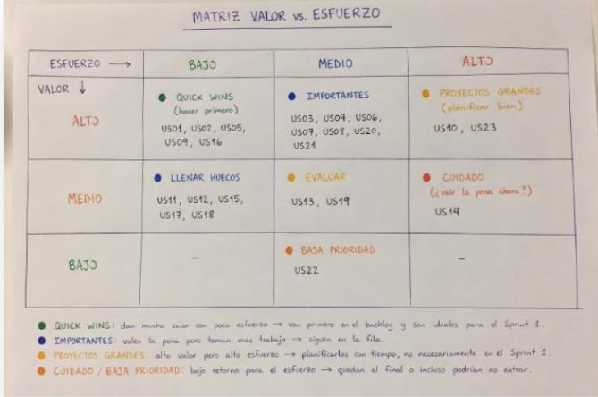
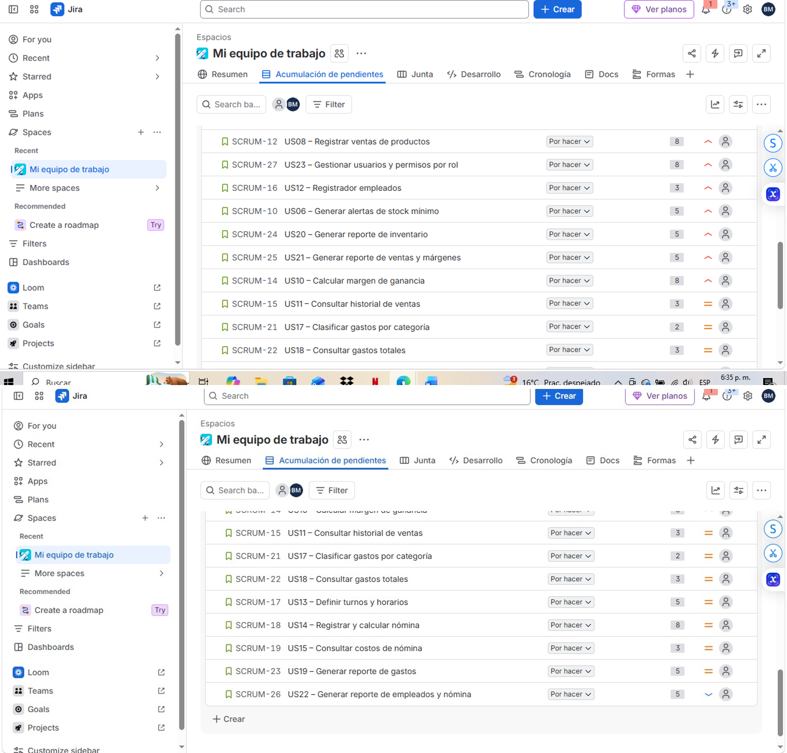
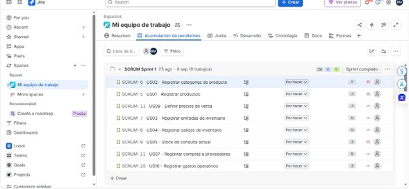
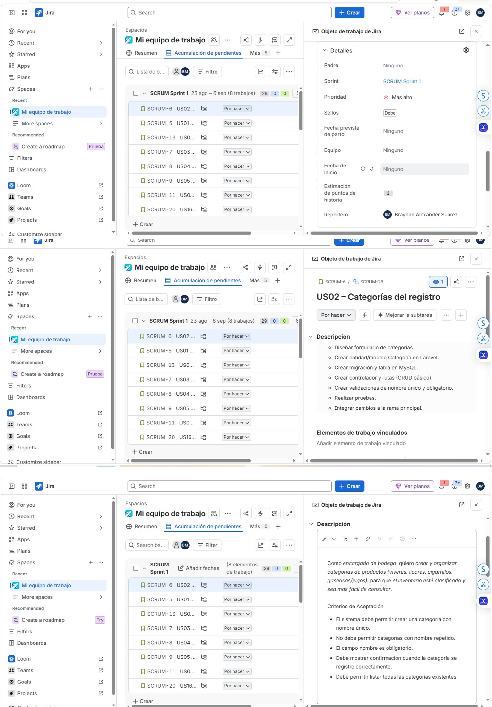

# 1. Product Backlog

Para la definición del Product Backlog del proyecto **ERP La 74**, el equipo elaboró un
listado completo de historias de usuario a partir de los requerimientos funcionales
(RF01-RF14) definidos previamente, distribuidas en los cinco módulos del sistema:
Inventario, Costos y Ventas, Empleados, Gastos y Reportes. En total se identificaron
**23 historias de usuario**.

El backlog fue priorizado utilizando dos técnicas complementarias:

- **MoSCoW** (Must, Should, Could, Won't), que permitió clasificar cada historia según
  su nivel de obligatoriedad para el funcionamiento mínimo del sistema.
- **Valor vs. Esfuerzo**, que permitió evaluar cada historia según el beneficio que
  aporta al negocio frente a la complejidad técnica de implementarla, identificando así
  los "Quick Wins" (alto valor, bajo esfuerzo) que debían priorizarse en los primeros
  sprints.

Con base en estas dos priorizaciones, el backlog fue ordenado colocando primero las
historias clasificadas como *Must* con menor esfuerzo, seguidas de las *Should* y
finalmente las *Could*, lo que garantiza que el equipo entregue primero el valor
esencial del negocio. El listado completo, ordenado y priorizado, se encuentra
documentado en Jira (sección Backlog) y se adjunta como evidencia en el Anexo.

## Matriz Valor vs. Esfuerzo

| Esfuerzo → / Valor ↓ | Bajo | Medio | Alto |
|---|---|---|---|
| **Alto** | Quick Wins (hacer primero): US01, US02, US05, US09, US16 | Importantes: US03, US04, US06, US07, US08, US20, US24 | Proyectos grandes (planificar bien): US10, US23 |
| **Medio** | Llenar huecos: US11, US12, US15, US17, US18 | Evaluar: US13, US19 | Cuidado (¿vale la pena ahora?): US14 |
| **Bajo** | — | Baja prioridad: US22 | — |

- **Quick Wins:** dan mucho valor con poco esfuerzo → van primero en el backlog y son ideales para el Sprint 1.
- **Importantes:** valen la pena pero toman más trabajo → siguen en la fila.
- **Proyectos grandes:** alto valor pero alto esfuerzo → planificarlos con tiempo, no necesariamente en el Sprint 1.
- **Cuidado / Baja prioridad:** bajo retorno para el esfuerzo → quedan al final o incluso podrían no entrar.

## Listado completo de las 23 historias de usuario

| ID Jira | Historia | Story Points |
|---|---|---|
| SCRUM-6 | US02 – Registrar categorías de producto | 2 |
| SCRUM-5 | US01 – Registrar productos | 3 |
| SCRUM-13 | US09 – Definir precios de venta | 3 |
| SCRUM-7 | US03 – Registrar entradas de inventario | 5 |
| SCRUM-8 | US04 – Registrar salidas de inventario | 5 |
| SCRUM-9 | US05 – Consultar stock actual | 3 |
| SCRUM-11 | US07 – Registrar compras a proveedores | 5 |
| SCRUM-20 | US16 – Registrar gastos operativos | 3 |
| SCRUM-12 | US08 – Registrar ventas de productos | 8 |
| SCRUM-27 | US23 – Gestionar usuarios y permisos por rol | 8 |
| SCRUM-16 | US12 – Registrar empleados | 3 |
| SCRUM-10 | US06 – Generar alertas de stock mínimo | 5 |
| SCRUM-24 | US20 – Generar reporte de inventario | 5 |
| SCRUM-25 | US21 – Generar reporte de ventas y márgenes | 5 |
| SCRUM-14 | US10 – Calcular margen de ganancia | 8 |
| SCRUM-15 | US11 – Consultar historial de ventas | 3 |
| SCRUM-21 | US17 – Clasificar gastos por categoría | 2 |
| SCRUM-22 | US18 – Consultar gastos totales | 3 |
| SCRUM-17 | US13 – Definir turnos y horarios | 5 |
| SCRUM-18 | US14 – Registrar y calcular nómina | 8 |
| SCRUM-19 | US15 – Consultar costos de nómina | 3 |
| SCRUM-23 | US19 – Generar reporte de gastos | 5 |
| SCRUM-26 | US22 – Generar reporte de empleados y nómina | 5 |

## Ejemplo de historia de usuario documentada (US02)

> Ejemplo de una historia de usuario con la descripción, los criterios de aceptación,
> las subtareas técnicas y el nivel de prioridad. Corresponde a US02 – Categorías del
> registro: *"Como encargado de bodega, quiero crear y organizar categorías de
> productos (víveres, licores, cigarrillos, gaseosas/jugos), para que el inventario
> esté clasificado y sea más fácil de consultar."*
>
> **Criterios de aceptación:**
> - El sistema debe permitir crear una categoría con nombre único.
> - No debe permitir categorías con nombre repetido.
> - El campo nombre es obligatorio.
> - Debe mostrar confirmación cuando la categoría se registre correctamente.
> - Debe permitir listar todas las categorías existentes.
>
> **Subtareas técnicas:**
> - Diseñar formulario de categorías.
> - Crear entidad/modelo Categoría en Laravel.
> - Crear migración y tabla en MySQL.
> - Crear controlador y rutas (CRUD básico).
> - Crear validaciones de nombre único y obligatorio.
> - Realizar pruebas.
> - Integrar cambios a la rama principal.

El listado completo de las 23 historias de usuario, con su descripción, criterios de
aceptación y subtareas, está disponible en el tablero de Jira del equipo:

[Product Backlog en Jira](https://erp-software-architecture-viveres-ylicores.atlassian.net/jira/software/projects/SCRUM/boards/1/backlog)
