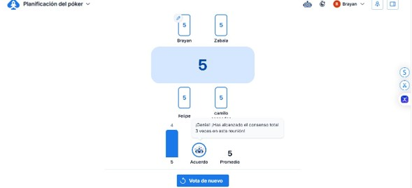
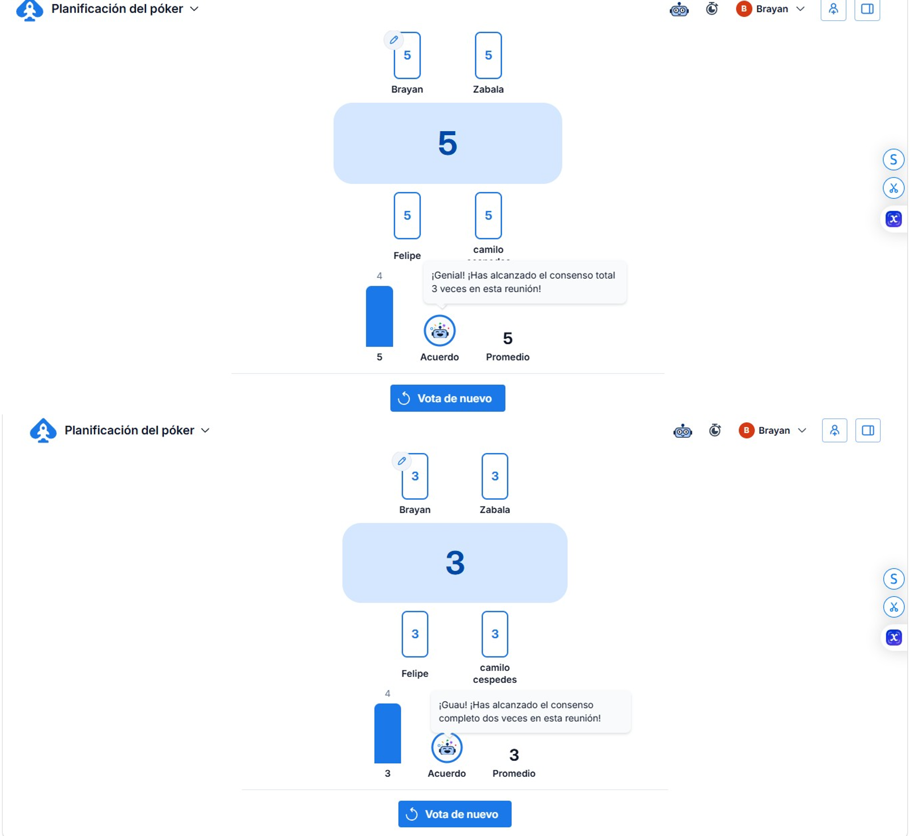
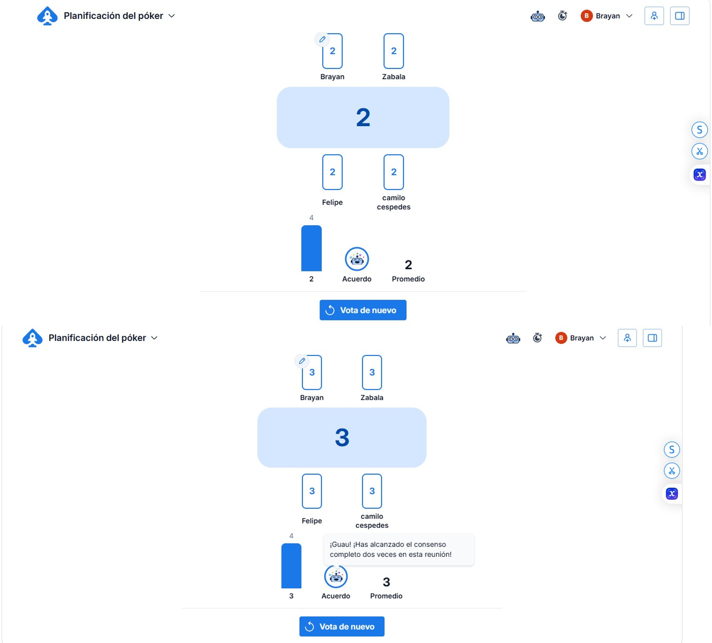

# 4. Estimar las User Stories (Planning Poker + Fibonacci)

Para estimar la complejidad de las historias de usuario seleccionadas en el Sprint 1, el
equipo realizó una sesión de **Planning Poker** utilizando la herramienta en línea
*Planning Poker Online*, la cual permitió a cada integrante votar de manera
independiente y simultánea utilizando la secuencia de Fibonacci (1, 2, 3, 5, 8, 13, 21).

Durante la sesión, se presentó cada historia de usuario del Sprint 1 al equipo y cada
integrante emitió su voto sin conocer las estimaciones de los demás. Una vez revelados
los votos, en los casos donde hubo diferencias significativas entre las estimaciones,
los integrantes con los valores más extremos justificaron su punto de vista y se
realizó una segunda ronda de votación hasta llegar a un consenso. Este proceso permitió
que la estimación reflejara la percepción colectiva del equipo sobre la complejidad de
cada historia, en lugar de basarse en el criterio de una sola persona.

## Resultado del consenso por historia

| Historia | Estimación (puntos de historia) |
|---|---|
| US02 – Registrar categorías de producto | 2 |
| US01 – Registrar productos | 3 |
| US09 – Definir precios de venta | 3 |
| US03 – Registrar entradas de inventario | 5 |
| US04 – Registrar salidas de inventario | 5 |
| US05 – Consultar stock actual | 3 |
| US07 – Registrar compras a proveedores | 5 |
| US16 – Registrar gastos operativos | 3 |
| **Total Sprint 1** | **29** |

El total estimado para el Sprint 1 fue de **29 Story Points**, cifra que fue
considerada adecuada por el equipo dada su capacidad de trabajo durante las dos
semanas de duración del sprint.

## Evidencia de la sesión de Planning Poker

Capturas de las rondas de votación en *Planning Poker Online*, donde se observa el
voto individual de cada integrante (Brayan, Zabala, Felipe y Camilo Cespedes) y el
consenso alcanzado para cada historia:

> En todas las rondas mostradas el equipo alcanzó consenso total en la primera
> votación, sin necesidad de una segunda ronda de discusión.