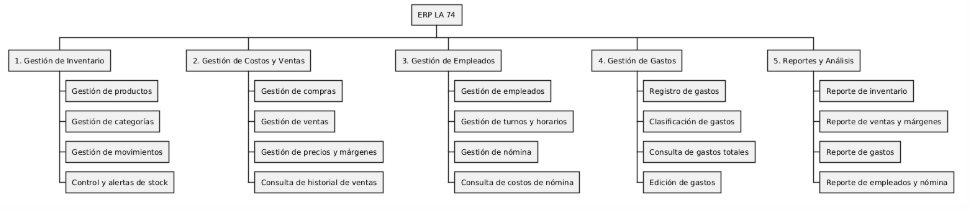
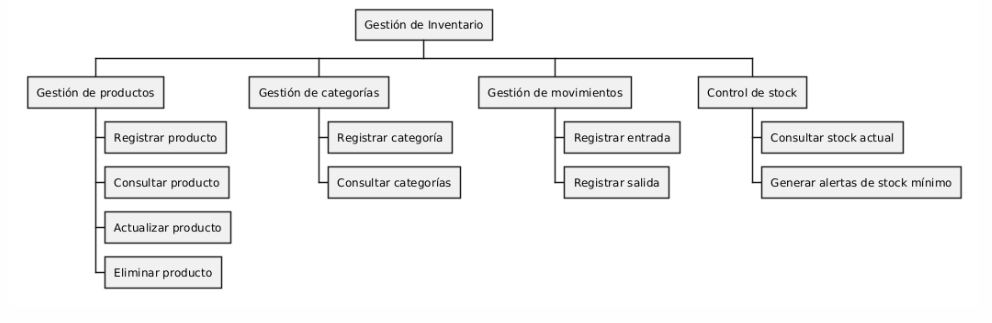
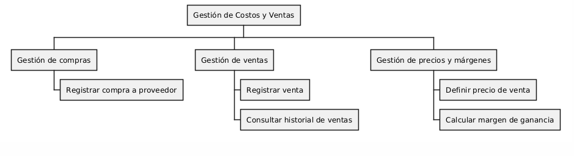
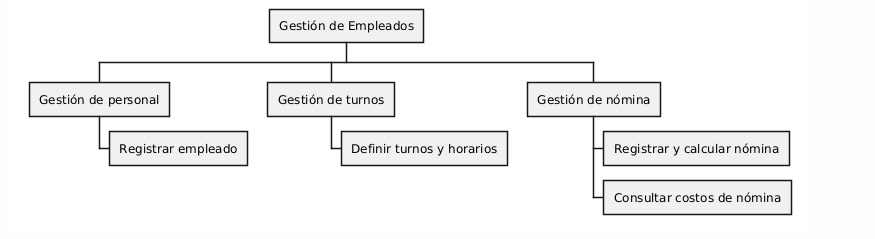
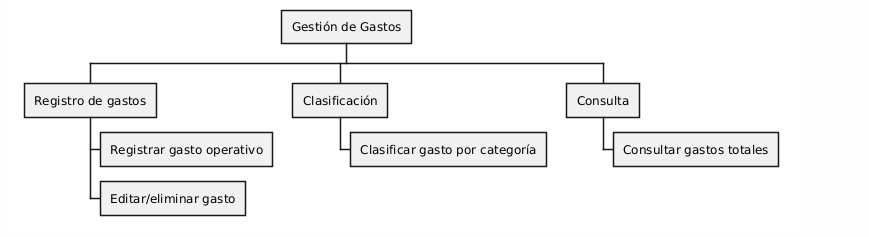
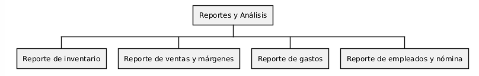

# 10. Árbol de descomposición funcional

## Árbol General

## Módulo 1 — Gestión de Inventario

## Módulo 2 — Gestión de Costos y Ventas

## Módulo 3 — Gestión de Empleados

## Módulo 4 — Gestión de Gastos

## Módulo 5 — Reportes y Análisis

